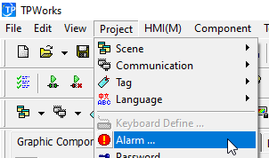
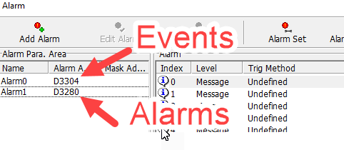
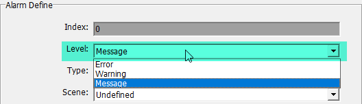
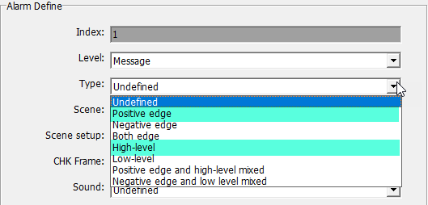
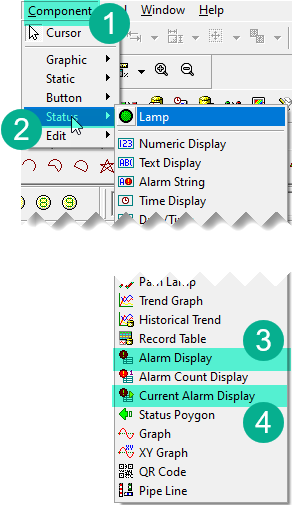

# Alarm Manager 128 Library for Coolmay FX3G PLC

## Roadmap

- Special register to contain system errors

## Terminology

- Alarm - is an object that stores Boolean state (TRUE\FALSE) along with other specific properties. It is an entity of types - Warning or Error.
- Event - is a reserved bit of TRUE\FALSE state. It is an entity of a type - Message.
- Register alarm - is an action during with Alarm goes from FALSE to TRUE state

## Description

This library helps you to manage different alarms and events in you processes. Main concept is that once you initialize all possible alarms. Then you set each alarm with different condition to register alarm state. Then you can get registered alarms filtered buy process number, severity to affect your processes logic in a POU.

You may create 128 alerts.

## Initialization

Before you can start using alarms you have to set where you want this data to be stored. When PLC starts use `M8002` set global parameter.

```iecst
IF M8002 THEN
    AM_D_START := 3000;
END_VAR
```

This means that all alerts data will be stored starting from `D3000`. It totally takes 313 registers. So `D3000`-`D3313` will be used to save alerts states and parameters.

To access your alarms from HMI or other device you can use 8 devices starting from `AM_D_START` + 280. For instance if you set `AM_D_START` to 3000, then `D3280` - `D3287` will contain states of your alarms by bits. `D3280.0` is alarm ID 0, `D3287.F` is alarm ID 127.





## Functions $ Function Blocks

| Name | Type | Description |
| --- | --- | --- |
| `AM_INIT` | Function Block | Initialize alarms |
| `AM_SET` | Function Block | Set condition for alarm to register |
| `AM_ON` | Function | Check individual alarm state |
| `AM_ORISON` | Function Block | Check individual alarm state with chain OR |
| `AM_RESET` | Function | (Deprecated, use `AM_RST`) Reset all alarms |
| `AM_RST` | Function Block | Reset all alarms |
| `AM_IS_BLOCK` | Function Block | Check if there are blocking alarms |
| `AM_HAS_ALARM` | Function Block | Check if there are alarms |
| `AM_BUZZER` | Function Block | Check if there are alarms for buzzer |
| `AM_EVENT` | Function Block | Create event |
| `AM_EVENT_RESET` | Function Block | Reset all events latched |

### AM_INIT

This block allows you to initialize properties of all alarms you plan to have. You should run this FB only once when program starts. You can use `M8002` flag to run block of code or separate program POU in a new Task.

| Variable | Scope | Type | Description |
| --- | --- | --- | --- |
| `iNum` | INPUT | ANY16 | Alarm ID. From 0 to 128 |
| `iSeverity` | INPUT | ANY16 | Severity of an alarm|
| `iProcess` | INPUT | ANY16 | Number of process. |
| `xLock` | INPUT | Bit | Does this alarm should lock (stop) the process |
| `xLatch` | INPUT | Bit | Is it a latching alarm |
| `xBuzzer` | INPUT | Bit | Does this alarm produce buzzer signal |

#### Alarm Properties

##### `iSeverity`

Severity defines weight of your alarm. Although it does not treat alarms differently and do not do any additional actions because of this property. It is lately used for filtering alarms. The values could be as number as global constant:

- `0` - Not set
- `1` - Message `AM_INFO`
- `2` - Warning `AM_WARNING`
- `3` - Error `AM_ERROR`

##### `iProcess`

Process number. This is a way to group your alarms to different categories. You can use any numbers here. For instance you have 2 different processes in your program. If one stops another should continue to work. So you init different alarms in different processes (groups) and then when check for registered alarms you can filter by this property.

##### `xLock`

Indicates either this alarm should lock or stop the process. Let's say you have gas heater. If fire detector fail to see fire you want to close Gaz valve. Then you setup "No fire" alarm as locking, and then you filter for all locking alarms and lock process if it is found.

##### `xLatch`

Latching alarms do not deregister itself when gone and require manual reset by operator. None-latching alarms are automatically deregistered as soon as an alarm condition switch to FALSE.

##### `xBuzzer`

Should this alarm to activate buzzer.

#### Example

Define function block instance in Local Label of your POU.

```iecst
VAR
    fbAMInit: AM_INIT;
END_VAR
```

Now in the body of POU

```iecst
IF M8002 THEN
    (* Sensor od AD0 of pressue lost connection *)
    fbAMINIT(iNum := 0, iProcess := 1, iSeverity := 2,
        xLock := TRUE, xLatch := FALSE, xBuzzer := TRUE);

    (* No fire alarm on X10 input *)
    fbAMINIT(iNum := 1, iProcess := 1, iSeverity := 3,
        xLock := TRUE, xLatch := TRUE, xBuzzer := TRUE);
END_IF
```

### AM_SET

This FB register alarms conditions. This is used on every program cycle.

| Variable | Scope | Type | Description |
| --- | --- | --- | --- |
| `iNum` | INPUT | ANY16 | Alarm ID. From 0 to 127 |
| `xState` | INPUT | Bit | Condition for alarm to be registered |

#### Example

Define function block instance in Local Label of your POU.

```iecst
VAR
    fbAMSet: AM_SET;
END_VAR
```

Now in the body of POU

```iecst
fbAmSet(iNum := 0, xState := (D8030 = 32760));
fbAmSet(iNum := 1, xState := (NOT X10));
```

If you want to use delay for alarm you have to use it manually. Turned out that it is hard to reserve even 32 not to say 128 timers when those could even not used. This version of Alarm Manger I give timeout control to user. Here is how.

```iecst
(* Alert will be set after 0.5 second (1 = 100ms) *)
OUT_T((D8030 = 32760), TC0, 5);
fbAmSet(iNum := 0, xState := TS0);

(* Alert will be set after 1 second (1 = 100ms) *)
OUT_T((NOT X10), TC1, 10);
fbAmSet(iNum := 1, xState := TS1);
```

### AM_ON

This is a function that detects a presence of a single alarm. Although it requires to input all those global variable, you can use this functions inside expression without saving result into intermidiate marker.

| Variable | Scope | Type | Description |
| --- | --- | --- | --- |
| `DNUM` | INPUT | ANY16 | Global variable `AM_D_START`.  |
| `ANUM` | INPUT | ANY16 | Global constant `AM_BLOCK_ALARM` |
| `iNum` | INPUT | ANY16 | Alarm ID. From 0 to 128 |

This function little bit cluttered, because we cannot use global variables in the function we have to pass it as a parameter. This makes it a bit long but as an exchange you can use it as a function in expressions.

```iecst
xErrorSensor := AM_ON(AM_D_START, AM_BLOCK_ALARM, 0);

IF AM_ON(AM_D_START, AM_BLOCK_ALARM, 1) THEN
    (* Do something *)
END_IF;
```

### AM_ORISON

This function block allow to check few alarms and combine them by OR logic.

| Variable | Scope | Type | Description |
| --- | --- | --- | --- |
| `iNum` | INPUT | ANY16 | Alarm ID.  |
| `Q` | IN_OUT | Bit | Result.  |

Define FB

```iecst
VAR
    fbAMOrIsOn: AM_ORISON;
    xResult: Bit;
END_VAR
```

Then in POU

```iecst
xResult := FALSE;
fbAMOrIsOn(iNum := 0,  Q := xResult);
fbAMOrIsOn(iNum := 5,  Q := xResult);
fbAMOrIsOn(iNum := 11, Q := xResult);

IF xResult THEN
    (* On of the 0, 5, 11 alarms is ON *)
END_IF;
```

### AM_RESET

Reset all alarms. Deprecated. Use `AM_RST` function block instead.

| Variable | Scope | Type | Description |
| --- | --- | --- | --- |
| `DNUM` | INPUT | ANY16 | Global variable `AM_D_START`.  |
| `DSTATE` | INPUT | ANY16 | Global constant `AM_BLOCK_STATE`.  |

#### Example

```iecst
IF MEP(xResetAlarms) THEN
    M0 := fbAMReset(AM_D_START, AM_BLOCK_STATE);
END_IF;
```

Again, because we cannot use global variables in function we have to pass it as a parameters. Also any function call should have left hand side, thus `M0 :=` is required.

### AM_RST

Reset all alarms. If you reset stated during one cycle, sometimes it is too fast to register alarm reset sync with HMI. It requires little bit longer reset time. This is what this FB is for. It holds resets during 1 second.

| Variable | Scope | Type | Description |
| --- | --- | --- | --- |
| `IN` | IN_OUT | Bit | Signal to reset by.  |

#### Example

Define FB

```iecst
VAR
    fbAMRst: AM_RST;
END_VAR
```

And then call in program

```iecst
fbAMRst(IN := xReset);
```

As an `IN` parameter use bit that should reset alarms. After alarms are reset this bit is reset too. So you may pass here a pulse or SET ON variable and it will reset itself after 1 second.

### AM_IS_BLOCK

Detects if there are registered alarms with `xLock` property `TRUE`.

| Variable | Scope | Type | Description |
| --- | --- | --- | --- |
| `iProcessNum` | INPUT | ANY16 | Number or process. If 0 will search through all alarms. If number will match against `iProcess` property of alarm given during initialization. |
| `iSeverity` | INPUT | ANY16 | Severity level. If 0 will search through all alarms. If number will match against `iSeverity` property of alarm given during initialization. |
| `Q` | OUTPUT | Bit | Result |

#### Example

Define function block instance in Local Label of your POU.

```iecst
VAR
    fbAMBlock: AM_IS_BLOCK;
END_VAR
```

Now in the body of POU. This example will have `Q` active if any registered alarm with `xLock` property is found.

```iecst
fbAMBlock();
IF NOT fbAMBlock.Q THEN
    (* Do something if there is not blocking alarm *)
END_IF;
```

This example will have `Q` active if any registered alarm with `xLock` property and severity level 3 (Error) is found.

```iecst
fbAMBlock(iSeverity := 3);
IF NOT fbAMBlock.Q THEN
    (* Do something if there is not blocking alarm *)
END_IF;
```

### AM_HAS_ALARM

Detects if there are any registered alarms.

| Variable | Scope | Type | Description |
| --- | --- | --- | --- |
| `iProcessNum` | INPUT | ANY16 | Number or process. If 0 will search through all alarms. If number will match against `iProcess` property of alarm given during initialization. |
| `iSeverity` | INPUT | ANY16 | Severity level. If 0 will search through all alarms. If number will match against `iSeverity` property of alarm given during initialization. |
| `Q` | OUTPUT | Bit | Result |

#### Example

Define function block instance in Local Label of your POU.

```iecst
VAR
    fbAMHas: AM_HAS_ALARM;
END_VAR
```

Now in the body of POU. This example will have `Q` active if any registered alarm is found.

```iecst
fbAMHas();
IF NOT fbAMHas.Q THEN
    (* Do something if there is not blocking alarm *)
END_IF;
```

This example will have `Q` active if any registered alarm with severity level 3 (Error) is found.

```iecst
fbAMHas(iSeverity := 3);
IF NOT fbAMHas.Q THEN
    (* Do something if there is not blocking alarm *)
END_IF;
```

### AM_BUZZER

Detects if there are any registered alarms with `xBuzzer` property.

| Variable | Scope | Type | Description |
| --- | --- | --- | --- |
| `Q` | OUTPUT | Bit | Result. One pulse when number of alarms increases |

#### Example

Define function block instance in Local Label of your POU.

```iecst
VAR
    fbAMBuzzer: AM_BUZZERER;
END_VAR
```

Now in the body of POU. This example will have `Q` active if any registered alarm with `xBuzzer` property is found. In this example `DO_Buzzer` is an PLC output for buzzer, `DI_BuzzerReset` is a PLC input button to reset buzzer signal.

```iecst
fbAMBuzzer();
SET(fbAMBuzzer.Q, DO_Buzzer);
RST(DI_ButtonBuzzerReset, DO_Buzzer);
```

## Events

Events are almost the same as alarms but do not have so many parameters. The main problem here is limitation of program to 32k steps. If create library for 256 alarms, if fully utilized, it might take 20k steps.

On the other hand there might be a lot of events that you only need to path to HMI to Alarm Manger as an information without using it in logic.

First note that in Coolmay HMI there is no separation between Alarms and Events. They all should be registered in Alarms manager. But in other HMIs alarms list and Events list are separated.


You just need to register them as Messages type.



There are basically 2 main event types:

- Positive Edge - Events of this type will self clear from active events to history after few seconds. Even if event is Latched.
- High Level - Events of this type will stay in active events table as long as event state is `TRUE`.



To access event in HMI you read 8 registers starting from `AM_D_START` + 304. For instance, you set `AM_D_START := 3000` then events will be stored in `D3304` - `D3312`. Every register stores 16 events, one for each bit. `D3304.0` will be even ID 0


### AM_EVENT

Adds new event.

| Variable | Scope | Type | Description |
| --- | --- | --- | --- |
| `EventNum` | INPUT | ANY16 | ID of the event |
| `EventState` | INPUT | Bit | Event state |
| `EventLatch` | INPUT | Bit | Should this event be latched |

All events with state `TRUE` are shown in current alarms table (4) and in Alarms history table (3). **Positive Edge** events in few seconds disappear from current alarms table and **High Level** events stay in current alarms table as long as they remain active. After event goes to `FALSE` it is still in alarms history but not in current alarm table.



#### Example

Define function block instance in Local Label of your POU.

```iecst
VAR
    fbAMEvent: AM_EVENT;
END_VAR
```

Now in the POU.

```iecst
(* Button started activated *)
fbAMEvent(EventNum := 0, EventState := X0);
(* Button started deactivated *)
fbAMEvent(EventNum := 2, EventState := NOT X0);
(* Water pump start working *)
fbAMEvent(EventNum := 3, EventState := Y0);
```

### AM_EVENT_RESET

Reset all events. This should be called only if you have Latched events. Otherwise events reset itself.

| Variable | Scope | Type | Description |
| --- | --- | --- | --- |
| `IN` | IN_OUT | Bit | Command to reset events |

Parameter `IN` is self cleared after 1 second.

```iecst
VAR
    fbAMEventReset: AM_EVENT_RESET;
END_VAR
```

Now in the POU.

```iecst
fbAMEventReset(IN := xReset);
```
