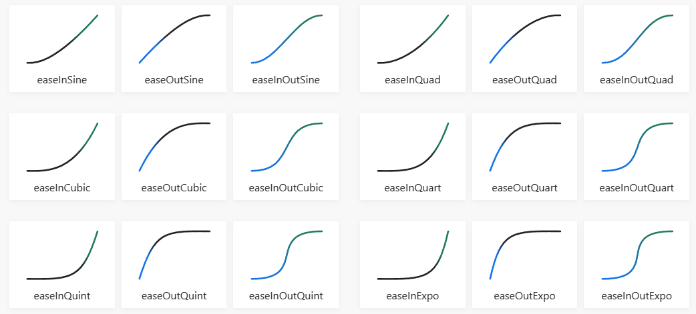

# Easing Library for Coolmay FX3G PLC

## Description

This library has functions to create ease-in, ease-out and ease-in-out curves.



These functions are used when you for example need to change value from point value `N` to value `N1` during exact timeframe. Used in position control to accelerate and decelirate movements. I used it in fountains to speed up pump for spring animation.

As an example might be a heater with slow raise temperature feature.

Let's say we have a heater and it has SV temperature as well as raise time and Hold time. It have to raise temperature to SV during exact time, slowly and then hold for another time.

```iecst
VAR
    xStart : BOOL; (* Start heater *)
    AI_Temperature : BOOL; (* Current temperature (PV) *)
    iStartTemperature : BOOL; (* Start temperature *)
    iSetTemperature : BOOL; (* Set temperature (SV) *)
    iTaskTemperature : BOOL; (* Surrent set temperature (CSV) *)
    iRaiseTime: INT; (* Time to raise temperature in 100ms incremets *)
    iHoldTime: INT; (* Time to hold temperature in 100ms incremets *)
END_VAR

IF MEP(xStart) THEN
    iStartTemperature := AI_Temperature;
END_IF;

(* Timer to raise temperature *)
OUT_T(xStart, TC0, iRaiseTime);
(* Timer to hold temperature *)
OUT_T(TS0, TC1, iHoldTime);

(* Set current CSV to SV *)
iTaskTemperature := iSetTemperature;
(* If we are on temperature raise stage set CSV to
linear from iStartTemperature to iSetTemperature *)
IF TS0 < iRaiseTime THEN
    iTaskTemperature := EASE_IN(TN0, iRaiseTime, iStartTemperature, iSetTemperature);
END_IF:

PID(TRUE, iTaskTemperature, AI_Temperature, D500, D499);
```

In this example `iTaskTemperature` is the SV for `PID` and `iSetTemperature` is SV for end temperature to hold. During hold temperature stage `iTaskTemperature` will be equal to `iSetTemperature`, but during raise stage `iTaskTemperature` will slowly linearly raise from `iStartTemperature` to `iSetTemperature`.

All easing functions have the same input variables.

```iecst
EASE_IN(CurrentTime, Duration, StartValue, EndValue);
```

- `CurrentTime` - Current time of a timer
- `Duration` - Timer time set
- `StartValue` - output value from
- `EndValue` - output value to

Lets say we have

```iecst
OUT_T(M0, TC0, 100);
D100 := EASE_IN(TN0, 100, 0, 500);
```

WHen `TN0` will be 0, `D100` will be 0, when `TN0` will be 100, `D100` will be 500. It means that when `TN0` will be 50 or half way through time, `D100` will be 250 half way through 0-500 range.

## Functions

| Name |  Description |
| ---  | --- |
| `EASE_IN`  | Linear |
| `` | |
| `` | |
| `` | |
| `` | |
| `` | |
| `` | |
| `` | |
