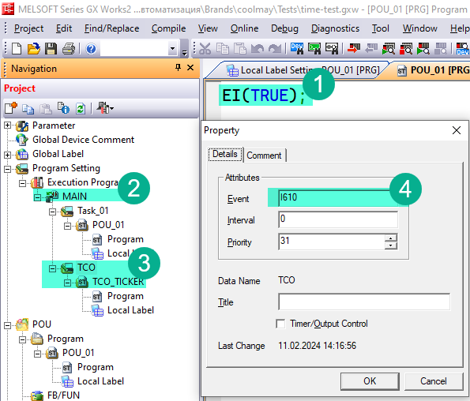
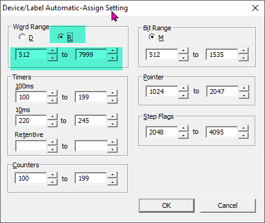

3# Time Control

This library require other libraries to be installed:

- Utils.sul

## Description

This library has helpers for standard GXW2 timers and it's own times to solve issue of arrays of timers.

TCO - Short of Time Controls;

## TCO Ticker Setup

This library tris to implement it's own timer counter like in CoDeSys that is returned by function `TIME()`.

This library have two global variables.

- `TCO_TIME` (Time) - Contain time in milliseconds from PLC start in TIME format
- `TCO_DINT` (Double word[Signed])  - Contain time in milliseconds from PLC start in DINT format

> **Important!!**
> That is important to know that this variables may store only 28 days of data, consider transition when developing your own timer.

In order for this variable to start working we have to start TCO ticker, few things have to be done.

1. In main `POU_01` program at the very beginning add

   ```iecst
   EI(TRUE);
   ```

   This enables global interrupts that is used for TCO ticker.

2. Right click in project tree *Program Settings/Execution Program/MAIN*, add new object type Task and name it TCO. With a right link on the new task created select properties and for event enter `I610` (4). This tells that this program will run every 10ms regardless main program execution time. Link for this task `TCO_TICKER_10` program (3) from TimeControl library.

   

> **Important!**
> Not all function blocks of this library require TCO ticker setup.

## TCO Helper Functions

### TIMEDIF

This function return calculation of time addresses `T#2_147_483_647ms` maximum limit on a time variable. `TCO_TIME` can calculate only until `T#2_147_483_647ms` or 24.8 days. The problem may accrue if you start timer, when `TCO_TIMER` is about to reach its limit and your timer value is longer the the time left to `T#2_147_483_647ms`.

> **Important!**
> Although we address this issue we can jump on timer reset only one time. This means your timers a still restricted 48 days.

| Variable | Scope | Type | Description |
| --- | --- | --- | --- |
| `Start` | INPUT | Time | Time when you started your timer |
| `Current` | INPUT | Time | current time is always `TCO_TIME`. We have to pass it because we cannot use global variables in a function. |

```iecst
IF MEP(IN) THEN
    StartTime := TCO_TIME;
END_IF;

ET := TIMEDIF(StartTime, TCO_TIME)
```

## General Functions And Blocks

### BLINK

Is a classical IEC 61131-3 block. This timer does not use TCO ticker.

| Variable | Scope | Type | Description |
| --- | --- | --- | --- |
| `TIMELOW` | INPUT | Bit | Time for output `Q` to be OFF |
| `TIMEHIGH` | INPUT | Bit | Time for output `Q` to be ON |
| `IN` | INPUT | ANY_16 | Enabled this timer to start working |
| `Q` | OUT | ANY_16 | Current state |

```iecst
VAR
    fbBlink: BLINK;
END_VAR

fbBlink(TIMELOW := T#1d, TIMEHIGH := T#1d, EN := X0);

Y0 := fbBlink.Q;     (* One day motor one *)
Y1 := NOT fbBlink.Q; (*One day motor two *)
```

### MIN_TO_TIME, SEC_TO_TIME

Helper conversion function to convert seconds or minutes to Time format.

```iecst
VAR
    fbBlink: BLINK;
    iChangeTime: INT; (* How often change motor in minuts *)
END_VAR

fbBlink(
    TIMELOW := MIN_TO_TIME(iChangeTime),
    TIMEHIGH := MIN_TO_TIME(iChangeTime),
    EN := X0
);

Y0 := fbBlink.Q;     (* One day motor one *)
Y1 := NOT fbBlink.Q; (*One day motor two *)
```

### MIN_TO_TIMER100, SEC_TO_TIMER100, TIME_TO_TIMER100, MIN_TO_TIMER10, SEC_TO_TIMER10, TIME_TO_TIMER10

Helpers to convert minutes, seconds or time format to 100ms or 10ms increments for standard timers `OUT_T()`.

```iecst
VAR
    iStartDelay: INT; (* In seconds *)
END_VAR

OUT_T(X0, TC10, SEC_TO_TIMER100(iStartDelay));
IF TS10 THEN
    (* Start process here *)
END_IF;
```

### TOD_IN_RANGE

This function checks if current time is within the given range. It addresses a problem when Start is in one day and end in another day earlier than start.

| Variable | Scope | Type | Description |
| --- | --- | --- | --- |
| `HourStart` | INPUT | ANY_16 | Start hour |
| `MinStart` | INPUT | ANY_16 | Start minute. |
| `HourEnd` | INPUT | ANY_16 | End hour |
| `MinEnd` | INPUT | ANY_16 | End minute. |

```iecst
xStart := TOD_IN_RANGE(10, 15, 22, 20);
```

This example will set `xStart` to `TRUE` if current time of the day is between 10:15 and 22:20.

### TON128

This is an array of 128 `TON` blocks. Let's discuss a problem. GXW2 has a limitation and does not allow you to create arrays of function blocks. That is sad, because I use it in CoDeSys all the time and it is hard for my to imagine how to create an elegant code without this feature. So if you want to access `TON` function blocks in a `FOR` cycle, this is a solution.

You will need define only one function block, to work with any of 128 timers.

This function block requires TCO ticker setup. These `TON` blocks have additional features. Any of those timers may work as retentive which means it does not reset Elapsed Time (`ET`) after `IN` is turned off.

Each call of this function block adds approximately 250 steps if you call it individually. And does not add new steps when called in `FOR` cycle.

> **Important!**
> Each new instance of this block will require 800 devices in a dynamic allocation memory. Go to *Menu/Tools/Device Labels Automatic Assign Settings...* and increase range for D registers accordingly. Or better switch D radio button to R and it will automatically assign 7000 devices and all dynamically allocated devices will be in R memory.
> 

#### Description

| Variable | Scope | Type | Description |
| --- | --- | --- | --- |
| `NUM` | INPUT | ANY16 | Index number of a timer in an array. 0-127 values are accepted. |
| `IN` | INPUT | bit | Timer to start (or resume if `MEM` is `TRUE`) working |
| `PT` | INPUT | Time | Time to work in time format `T#2s` |
| `MEM` | INPUT | Bit | If this timer is going to be retentive. That means that after `IN` is set of, `ET` is not going to be reset. Next time we enable timer with `IN` it will continue time count rather than start over.  |
| `RESET` | INPUT | Bit | Set `TRUE` if you want to reset retentive timer before it reached its `PT` time |
| `ET` | OUTPUT | Time | Elapsed time. How long timer is working while `IN` is `TRUE` |
| `Q` | OUTPUT | Bit | `TRUE` when timer reached its `PT` time. |

#### Examples

Lets create an example. We take 4 DI inputs and set 4 outputs after 2 seconds there is TRUE on input.

```iecst
FOR iCount := 0 TO 3 DO
    Z5 := iCount;
    fbMTON(
        NUM := iCount,
        IN := X10Z5,
        PT := T#2s,
        Q := Y0Z5
        MEM := FALSE,
        RESET := FALSE
    );
END_FOR;
```

In case you do not know what is `X10Z5`, when `Z5` is 0 it will refer to `X10`, when it is 3 it will refer to `X13`. So it means that `X10`, `X11`, `X12`, `X13` are inputs for timers and `Y0`, `Y1`, `Y1` and `Y2` are outputs.
