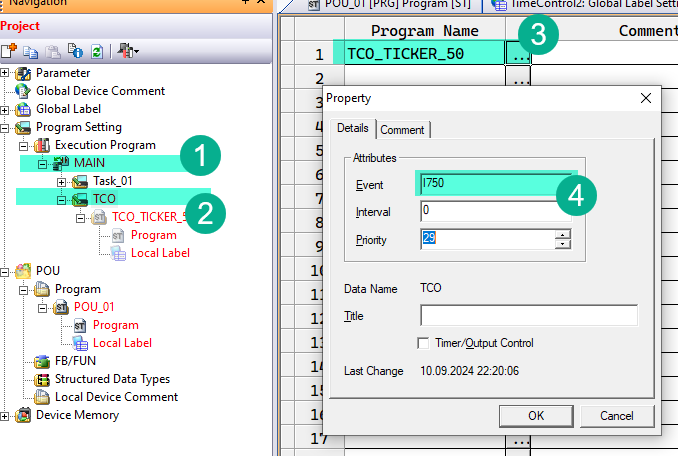

# Time Control 50

This library require other libraries to be installed:

- Utils.sul

## Description

This library provides timer that increments by 50ms.

TCO - Short of Time Controls;

## TCO Ticker Setup

This library tris to implement it's own timer counter like in CoDeSys that is returned by function `TIME()`.

This library have two global variables that contain current timer (TICKER).

- `TCO_DINT_50` (Double word[Signed]) - Contain number of 50ms increments from PLC start in UDINT format stores approximately 3.4 years.
- `TCO_INT_50` (Word[Signed]) - Contain number of 50ms increments from PLC start in UINT format stores approximately 30 minutes.

> **Important!!**
> Please select right counter INT or DINT depending on maximum interval you have. I recommend for intervals up to 10 seconds use `TCO_INT_50` and for the rest use `TCO_DINT_50`

In order for this variable to start working we have to start TCO ticker, few things have to be done.

1. In main `POU_01` and all other programs you have to add at as a very first line:

   ```iecst
   EI(TRUE);
   ```

   This enables global interrupts that is used for TCO ticker.

2. Right click in project tree *Program Settings/Execution Program/MAIN* (1), add new object type Task and name it TCO (2). With a right link on the new task created select properties and for event enter `I750` (4). This tells that this program will run every 50ms regardless main program execution time. Link for this task `TCO_TICKER_50` program (3) from TimeControl50 library.

   

## TCO Helper Functions

### TCO_50_TO_SEC, DTCO_50_TO_SEC, TCO_50_TO_100MS, DTCO_50_TO_100MS, TCO_50_TO_MIN, DTCO_50_TO_MIN

These functions convert `TCO_DINT_50` or `TCO_INT_50` into seconds, minutes or 100ms increments.

```iecst
EI(TRUE);
iCurrentSeconds := TCO_50_TO_SEC(TCO_INT_50);
diCurrentSeconds := DTCO_50_TO_SEC(TCO_DINT_50);
```

Where `iCurrentSeconds` is (Word[Signed]) and `diCurrentSeconds` is (Double word[Signed]).

### TCO_50_DIFF, DTCO_50_DIFF

This function returns a difference in 50ms increments between current time and saved point.

```iecst
EI(TRUE);

IF MEP(M0) THEN
    iStart := TCO_INT_50;
END_IF;

IF MEF(M0) THEN
    iEnd := TCO_50_TO_SEC(TCO_50_DIFF(iStart, TCO_INT_50));
END_IF;
```

This program example saves in `iEnd` how many seconds `M0` was in `TRUE` state, since `MEP` is a raise trigger and `MEF` is a fall trigger.

## General Functions And Blocks

### TCO_50_BLINK, DTCO_50_BLINK

Is a classical IEC 61131-3 block. It starts with `TIMELOW` interval. It also unlike CoDeSys BLINK turn output off in `IN` is `false`

#### DTCO_50_BLINK

| Variable   | Scope | Type                  | Description                         |
| ---------- | ----- | --------------------- | ----------------------------------- |
| `TIMELOW`  | INPUT | (Double word[Signed]) | Time for output `Q` to be OFF       |
| `TIMEHIGH` | INPUT | (Double word[Signed]) | Time for output `Q` to be ON        |
| `IN`       | INPUT | Bit                   | Enabled this timer to start working |
| `Q`        | OUTPUT| Bit                   | Current state                       |

#### TCO_50_BLINK

| Variable   | Scope  | Type           | Description                         |
| ---------- | ------ | -------------- | ----------------------------------- |
| `TIMELOW`  | INPUT  | (Word[Signed]) | Time for output `Q` to be OFF       |
| `TIMEHIGH` | INPUT  | (Word[Signed]) | Time for output `Q` to be ON        |
| `IN`       | INPUT  | Bit            | Enabled this timer to start working |
| `Q`        | OUTPUT | Bit            | Current state                       |

```iecst
VAR
    fbBlink: DTCO_50_BLINK;
END_VAR

fbBlink(TIMELOW := DMIN_TO_TCO_50(1440), TIMEHIGH := DMIN_TO_TCO_50(1440), EN := X0);

Y0 := fbBlink.Q;     (* One day motor one *)
Y1 := NOT fbBlink.Q; (* One day motor two *)
```

This example rotates motors by 24 hours intervals

### TCO_50_TON128

This is an array of 128 `TON` blocks. Let's discuss a problem. GXW2 has a limitation and does not allow you to create arrays of function blocks. That is sad, because I use it in CoDeSys all the time and it is hard for me to imagine how to create an elegant code without this feature. So if you want to access `TON` function blocks in a `FOR` cycle, this is a solution.

You will need define only one function block, to work with any of 128 timers.

These `TON` blocks have additional features. Any of those timers may work as retentive which means it does not reset Elapsed Time (`ET`) after `IN` is turned off.

Each call of this function block adds approximately 100 steps if you call it individually. And does not add new steps when called in `FOR` cycle.

> **Important!**
> Each new instance of this block will require 800 devices in a dynamic allocation memory. Go to *Menu/Tools/Device Labels Automatic Assign Settings...* and increase range for D registers accordingly. Or better switch D radio button to R and it will automatically assign 7000 devices and all dynamically allocated devices will be in R memory.
> 
> 

#### Description

| Variable | Scope  | Type                  | Description                                                                     |
| -------- | ------ | --------------------- | ------------------------------------------------------------------------------- |
| `NUM`    | INPUT  | (Word[Signed])        | Index number of a timer in an array. 0-127 values are accepted.                 |
| `IN`     | INPUT  | bit                   | Timer to start (or resume if `MEM` is `TRUE`) working                           |
| `PT`     | INPUT  | (Double word[Signed]) | Time to work in 50ms increments                                                 |
| `MEM`    | INPUT  | Bit                   | If this timer is going to be retentive.                                         |
| `RESET`  | INPUT  | Bit                   | Set `TRUE` if you want to reset retentive timer before it reached its `PT` time |
| `ET`     | OUTPUT | (Double word[Signed]) | Elapsed time. How long timer is working while `IN` is `TRUE`                    |
| `Q`      | OUTPUT | Bit                   | `TRUE` when timer reached its `PT` time.                                        |

#### Examples

Lets create an example. We take 4 DI inputs and set 4 outputs after 2 seconds there is TRUE on input.

```iecst
FOR iCount := 0 TO 3 DO
    Z5 := iCount;
    fbMTON(
        NUM := iCount,
        IN := X10Z5,
        PT := DSEC_TO_TCO_50(20),
        Q := Y0Z5
        MEM := FALSE,
        RESET := FALSE
    );
END_FOR;
```

In case you do not know what is `X10Z5`, when `Z5` is 0 it will refer to `X10`, when it is 3 it will refer to `X13`. So it means that `X10`, `X11`, `X12`, `X13` are inputs for timers and `Y0`, `Y1`, `Y1` and `Y2` are outputs.
