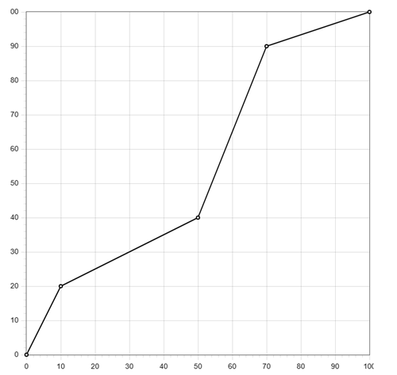

# Utils for Coolmay FX3G PLC

## Description

This library provides useful functions

## SCALE_AI, L02_SCALE_AI

Function to scale AI input into mesured values.

| Variable | Scope | Type | Description |
| --- | --- | --- | --- |
| `AINum` | INPUT | ANY16 | Number of AI 0-16 |
| `SType` | INPUT | ANY16 | type of the sensor. See list of types below. |
| `Min` | INPUT | ANY16 | Minimum of measured unit. If type is not 0-10V, 0-20mA or 4-20mA this parameters are not applied. |
| `Max` | INPUT | ANY16 | Maximum of measured unit. If type is not 0-10V, 0-20mA or 4-20mA this parameters are not applied. |
| `FilterTime` | INPUT | ANY16 | Filter input by time. From 1ms to 60ms. Default 10ms. **For L02 is not applied**. |
| `FilterNum` | INPUT | ANY16 | Filtering cycles, default is 100 (range 2~20000), data can’t be equal to or less than 0. One PLC scan cycle sample one time and change the 1st analog input value for one time. The larger value is, the result is more stable. **For L02 is not applied**. |
| `ValueOut` | OUTPUT | ANY16 | Scaled value |
| `ErrWire` | OUTPUT | Bit | Wire out error |
| `ErrLimit` | OUTPUT | Bit | Input values error. Minimum value is more than maximum. |

There are following times

- `STYPE_PT100`
- `STYPE_PT1000`
- `STYPE_TC_K`
- `STYPE_NTC`
- `STYPE_0_10V`
- `STYPE_0_20MA`
- `STYPE_4_20MA`
- `STYPE_NTC10K`
- `STYPE_TC_E`
- `STYPE_TC_T`
- `STYPE_TC_S`
- `STYPE_TC_J`

Let's say you have connected 4-20mA pressure sensor at AI0 (AD0). that sensor measure range is 0-16 bar. You want to convert values on that analog input to bars with precision of 0.1.

First declare function block.

```iecst
VAR
    fbScale : SCALE_AI;
    AI0_Pressure: INT;
END_VAR
```

Then in a program

```iecst
fbScale(AINum := 0, SType := STYPE_4_20MA, Min := 0, Max := 160,
    (* Increas filter for smoother result *)
    FilterTime := 30, FilterNum := 200,
    ValueOut := AI0_Pressure
);

IF (fbScale.ErrWire) THEN
    (* Wire connection problem *)
END_IF;
```

## SACLE

Function to scale one value to another proportionally.

| Variable | Scope | Type | Description |
| --- | --- | --- | --- |
| `Val` | INPUT | ANY16 | Current value |
| `inLow` | INPUT | ANY16 | Current value minimum |
| `inHigh` | INPUT | ANY16 | Current value maximum |
| `outLow` | INPUT | ANY16 | New value minimum |
| `outHigh` | OUTPUT | ANY16 | New value maximum |

For example you want to scale 0-100% of a PID regulator to analog output `DA0`

```iecst
D8020 := SACLE(iPIDTask, 0, 100, 0, 4000);
```

`iPIDTask` may have value from 0 to 100, and `D8020` is a system register with control analog output `AD0` which accepts values 0-4000.

## SACLE_NL

Function to scale one value to another with none-linear proportions.

| Variable | Scope | Type | Description |
| --- | --- | --- | --- |
| `PN` | INPUT | ANY16 | Number of points |
| `DTART` | INPUT | ANY16 | What device starts to store value |
| `PV` | INPUT | ANY16 | Processed value on X scale to scale to Y |

First you have to pack data. Let' say you want to create a 5 point graph started from `D100`. First device will keep number of points, and then points values.

```
D100 = Number of points
D101 = X1
D102 = X2
D103 = X3
D104 = X4
D105 = X5
D106 = Y1
D107 = Y2
D108 = Y3
D109 = Y4
D110 = Y5
```

Where X1-X5 and Y1-Y5 are not PLC inputs and outputs but point coordinates on X and Y scale. Let's say you have following values.

```
D100 = 5
D101 = 0
D102 = 10
D103 = 50
D104 = 70
D105 = 100
D106 = 0
D107 = 20
D108 = 40
D109 = 90
D110 = 100
```

This means we created a graph



Now we have 4 linear scale lines. Horizontal line is our measured value scale and vertical is what we convert it too. For instance is our `PV` will be 10 then output will be 20. If `PV` is 5 then output is 10. When you use Coolmay panel you can use XY Graph element, pass there D100 register and it will draw this graph.

In the code you can use it like this.

```iecst
D200 := SACLE_NL(5, 100, Pv);
```

## HYST

On\Off regulator function block.

| Variable | Scope | Type | Description |
| --- | --- | --- | --- |
| `xIn` | INPUT | Bit | Enable regulator |
| `iSV` | INPUT | ANY16 | Set value |
| `iPV` | INPUT | ANY16 | Processed value |
| `iDV` | INPUT | ANY16 | Delta |
| `Q` | OUTPUT | Bit | ON or OFF |

Here is an example how you can get a temperature on an `AD0` and use it in hysteresis regulator to control heater on `Y0` output.

```iecst
(* Get temperature on AD0 neasure -80.0 to 500.0 *)
fbScale(AINum := 0, Min := -800, Max := 5000,
    ValueOut := AI_Temperature
);

fbHYST(
    xIn := xStart,
    iSV := 255, (* Set value is 25.5 *)
    iPV := AI_Temperature,
    iDV := 2, (* Delat is 0.2 *)
    Q := Y0
);
```

## VALVE_3P

Function to control 3 position valve with PID. It is not and a pulse regulator but regulator with constant position search.

> Important !!!
> **This function required TimeControl library and TCO timer setup**

| Variable | Scope | Type | Description |
| --- | --- | --- | --- |
| `Enable` | INPUT | Bit | Start valve control |
| `SV` | INPUT | ANY16 | Set valve position. It is 0-1000. Best configure PID task output to be 0-1000, If you created 0-100 output for PID, multiply it by 10. |
| `TOTAL_TIME` | INPUT | TIME | Total time it takes for valve to move from fully CLOSED position to fully OPEN. Make it little bit bigger (2%) |
| `LUFT_TIME` | INPUT | TIME | Time required to move on direction change for valve to start moving. |
| `DLT` | INPUT | ANY16 | Hysteresis for regulator. If difference between `SV` and current position is less that this value we do not move valve. It may reduce number of position changes when it is almost at the spot and save motor resources. |
| `OFF_CLOSE` | INPUT | Bit | When we turn off control with `Enabled := FALSE` should we close valve or leave it in a current position? |
| `OPEN` | OUTPUT | Bit | Open valve signal |
| `CLOSE` | OUTPUT | Bit | Close valve signal |

Here is an example

```iecst
Valve_3p1(
    ENABLE := X0,
    SV := D0,
    TOTAL_TIME := T#10s,
    LUFT_TIME := T#500ms,
    DLT := 50,
    OPEN := Y0,
    CLOSE := Y1
);
```

## WORK_LEFT

Function to calculate integer 0-100% how much time is left for timer to finish. Usually used for HMI progress bar.

| Variable | Scope | Type | Description |
| --- | --- | --- | --- |
| `TW` | INPUT | ANY16 | Timer set time |
| `ET` | INPUT | ANY16 | Timer elapsed time |

Here is an example

```iecst
OUT_T(TRUE, TC10, 10);
D100 := WORK_LEFT(10, TN10);
```

Now `D100` will have countdown from 100 to 0.

## ISBON \ DISBON

Function to check if a given bit in a WORD or DWORD is on. There is built-in `BON` instruction, but it does not return the value but store it in a parameter you pass to instruction. This is inconvenient. This functions you can use inside expressions.

| Variable | Scope | Type | Description |
| --- | --- | --- | --- |
| `IN` | INPUT | WORD | The WORD to check |
| `BN` | INPUT | ANY16 | Bit number starts form 0 |

```iecst
IF ISBON(D100, 2) THEN
    (* The third bit in D100 is ON *)
END_IF;
```

## SETB \ DSETB

This function set given bit in a `WORD` (`SETB`) or `DWORD` (`DSETB`) to 1

| Variable | Scope | Type | Description |
| --- | --- | --- | --- |
| `IN` | INPUT | WORD\DWORD | The WORD to check |
| `BN` | INPUT | ANY16 | Bit number starts form 0 |

```iecst
(* Sets the third bit in D100 to 1 *)
D100 := SETB(D100, 2)
```

## RSTB \ DRSTB

This function reset given bit in a `WORD` (`SETB`) or `DWORD` (`DSETB`) to 1

| Variable | Scope | Type | Description |
| --- | --- | --- | --- |
| `IN` | INPUT | WORD\DWORD | The WORD to check |
| `BN` | INPUT | ANY16 | Bit number starts form 0 |

```iecst
(* Resets the third bit in D100 to 0 *)
D100 := RSTB(D100, 2)
```

## SRB

This function reset given bit in a `WORD` (`SETB`) or `DWORD` (`DSETB`) to 1

| Variable | Scope | Type | Description |
| --- | --- | --- | --- |
| `IN` | INPUT | WORD\DWORD | The WORD to check |
| `BN` | INPUT | ANY16 | Bit number starts form 0 |
| `State` | INPUT | Bit | What to set 0  or 1 (`TRUE` or `FALSE`) |

```iecst
D100 := SRB(D100, 2, FALSE);
D100 := SRB(D100, 3, TRUE);
```
